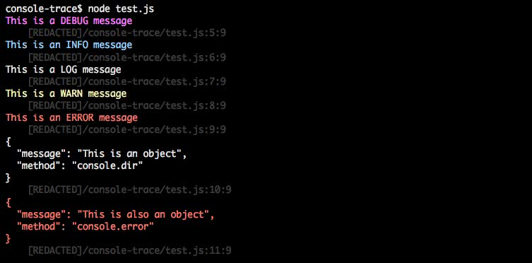

# console-trace

Monkey-patched console with trace to caller (file/line) as well as color and better object handling.

## Installation
```
$ npm install console-trace --save
```

## Usage
```javascript
require('console-trace');

console.debug('This is a DEBUG message');
console.info('This is an INFO message');
console.log('This is a LOG message');
console.warn('This is a WARN message');
console.error('This is an ERROR message');
console.dir({message: 'This is an object', method: 'console.dir'});
console.error({message: 'This is also an object', method: 'console.error'});

```


## License

MIT © [Kyle Wilson](https://github.com/waffledonkey)
